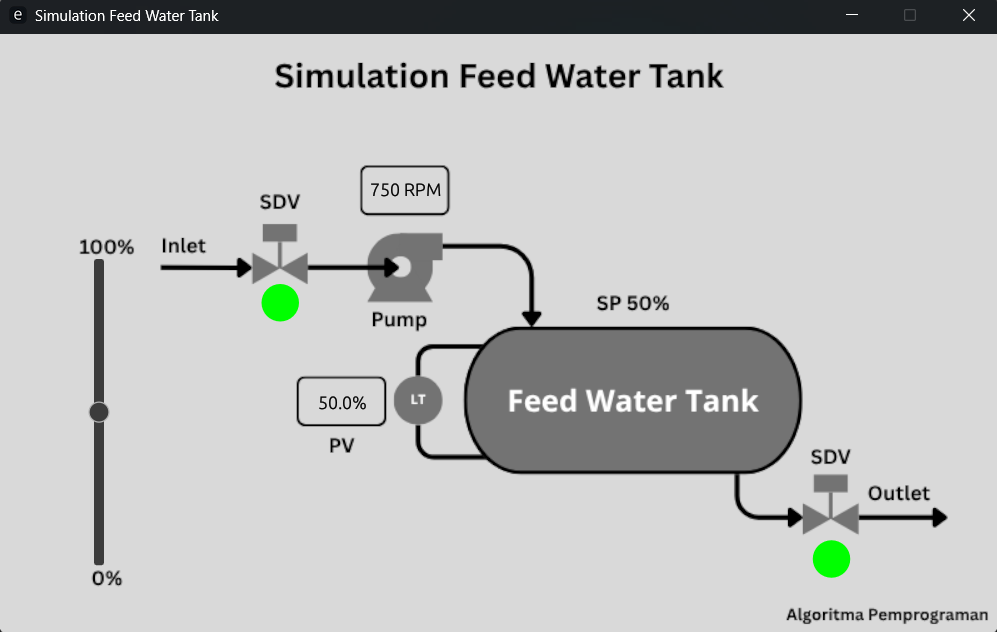

<div align="center">

# 💧 Simulation Feed Water Tank Monitoring & Control System

### GUI-Based Industrial Process Simulation with BPCS and SIS Integration

<br>


<br><br>

Industrial process simulation project developed using **Rust** with real-time GUI visualization, signal processing, proportional control, and safety interlock implementation based on industrial automation principles.

</div>

---

# 👨‍💻 Authors

| Name | Student ID |
|---|---|
| Ahmad Fauzi Abdul Razzaq | 2042241017 |
| Sintia Ompusunggu | 2042241113 |

Department of Instrumentation Engineering  
Institut Teknologi Sepuluh Nopember (ITS)

---

# 📘 Project Overview

This project presents the development of a **Feed Water Tank (FWT)** monitoring and control simulation system designed to emulate an industrial boiler feed water process environment.

<p align="center">
  
  <br>
  <em>Feed Water Tank Simulation Interface</em>
</p>

<p align="center">
  
  <br>
  <em>Flowchart Program</em>
</p>

<p align="center">
  
  <br>
  <em>Flowchart BPCS & SIS</em>
</p>

The application integrates:

- **Basic Process Control System (BPCS)**
- **Safety Instrumented System (SIS)**
- Real-time process monitoring
- Signal filtering and noise simulation
- Industrial safety interlock logic
- GUI visualization based on P&ID layout

The system is implemented using the Rust programming language with the `eframe` and `egui` GUI framework, providing responsive immediate-mode rendering suitable for real-time industrial simulation.

---

# 🏗️ System Architecture

graph TD
    A["<b>Operator GUI</b><br>(Rust + eframe + egui)"] 
    B["<b>Signal Processing Layer</b><br>Noise Generator + MA Filter"]
    C["<b>BPCS</b><br>Proportional Level Control"]
    D["<b>SIS</b><br>Safety Interlock Protection"]
    E["<b>Feed Water Tank Process</b><br>(SDV + Pump + LT Simulation)"]

    A --> B
    B --> C
    C --> D
    D --> E

    %% Penyesuaian warna agar terlihat seperti blok kode gelap %%
    style A fill:#1f2328,stroke:#d0d7de,color:#fff
    style B fill:#1f2328,stroke:#d0d7de,color:#fff
    style C fill:#1f2328,stroke:#d0d7de,color:#fff
    style D fill:#1f2328,stroke:#d0d7de,color:#fff
    style E fill:#1f2328,stroke:#d0d7de,color:#fff
---

# ✨ Main Features

### 🎛️ Real-Time Industrial GUI
- Interactive operator interface
- P&ID-based visualization
- Immediate-mode rendering architecture

### 📊 Signal Processing
- Random sensor noise simulation
- Moving Average filtering
- Stable process variable visualization

### ⚙️ BPCS Control System
- Proportional level controller
- Continuous setpoint regulation
- Real-time corrective response

### 🛡️ SIS Protection System
- Overflow prevention mechanism
- Dry-run pump protection
- Independent safety interlock logic

---

# 🛠️ Technologies Used

| Component | Technology |
|---|---|
| Programming Language | Rust |
| GUI Framework | eframe / egui |
| Image Rendering | egui_extras |
| Signal Noise Generator | rand |
| PNG Decoder | image crate |
---

# 📂 Project Structure

```text
feed_water_tank/
│
├── src/
│   └── main.rs
│
├── target/
│
├── .gitignore
├── Cargo.toml
├── Cargo.lock
└── README.md
```
---

# 🚀 Build & Run

```bash
cargo run
```

The application will automatically launch the GUI simulation window.

---

# 🎮 System Operation

## Normal Operating Mode

The operator adjusts the tank level using a slider interface.  
The signal is processed through:

- Random noise generation
- Moving Average filtering

The BPCS continuously regulates the process toward the default setpoint:

```text
SP = 50%
```

---

# 🚨 SIS Safety Protection

## Overflow Protection

Condition:

```text
PV ≥ 90%
```

Action:
- Inlet SDV closes automatically

---

## Dry Run Protection

Condition:

```text
PV ≤ 10%
```

Action:
- Outlet SDV closes
- Pump shuts down automatically

---

# 📈 Signal Processing Equation

```text
PV_filtered = (1/N) Σ(x_raw + η)
```

| Symbol | Description |
|---|---|
| N | Number of samples |
| x_raw | Raw operator input |
| η | Random noise |

---

# 🧠 BPCS Control Equation

```text
CV_BPCS = Bias + (Kp × (SP − PV_filtered))
```

| Parameter | Value |
|---|---|
| Kp | 18.75 |
| SP | 50% |
| Bias | 750 |

---

# 🖥️ GUI Components

The graphical interface includes:

- Feed Water Tank visualization
- Inlet SDV indicator
- Outlet SDV indicator
- Pump status indicator
- Process Variable (PV) display
- Setpoint display
- Level Transmitter (LT)
- Industrial P&ID background

---

# 📊 Project Status

| Category | Status |
|---|---|
| GUI Rendering | ✅ Operational |
| Signal Processing | ✅ Operational |
| BPCS Logic | ✅ Operational |
| SIS Interlock | ✅ Operational |
| Academic Presentation | ✅ Ready |

---

# 🎓 Educational Context

This project is suitable for:

- Industrial automation learning
- Process control simulation
- Instrumentation engineering education
- SIS/BPCS architecture studies
- Rust GUI development practice

---

<div align="center">

### Developed for the Algorithm Programming Course

Department of Instrumentation Engineering  
Institut Teknologi Sepuluh Nopember (ITS)

</div>
